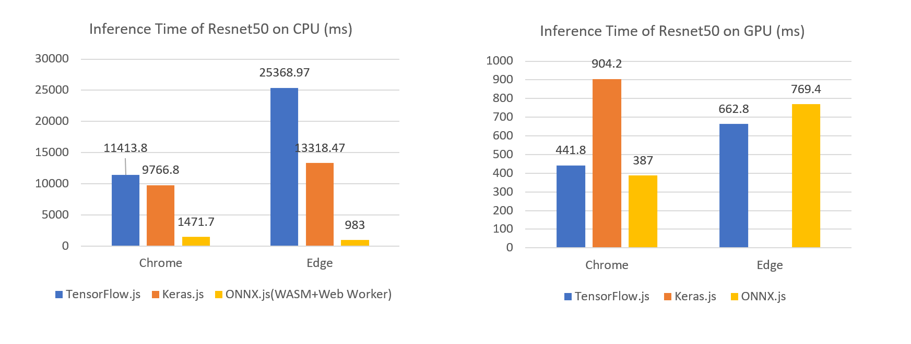

[](https://badge.fury.io/js/onnxjs)
[](https://badge.fury.io/gh/Microsoft%2Fonnxjs)
[?label=Windows+CPU+(Electron)>)](https://dev.azure.com/onnxruntime/onnxjs/_build/latest?definitionId=24)
[?label=Windows+CPU+(Node.js)>)](https://dev.azure.com/onnxruntime/onnxjs/_build/latest?definitionId=20)
[?label=Windows+GPU+(Chrome%2CEdge)>)](https://dev.azure.com/onnxruntime/onnxjs/_build/latest?definitionId=22)
[?label=Linux+CPU+(Node.js)>)](https://dev.azure.com/onnxruntime/onnxjs/_build/latest?definitionId=5)
[?label=BrowserStack+(Suite0)>)](https://dev.azure.com/onnxruntime/onnxjs/_build/latest?definitionId=17)

# ONNX.js

ONNX.js is a Javascript library for running ONNX models on browsers and on Node.js.

ONNX.js has adopted WebAssembly and WebGL technologies for providing an optimized ONNX model inference runtime for both CPUs and GPUs.

### Why ONNX models

The [Open Neural Network Exchange](http://onnx.ai/) (ONNX) is an open standard for representing machine learning models. The biggest advantage of ONNX is that it allows interoperability across different open source AI frameworks, which itself offers more flexibility for AI frameworks adoption. See [Getting ONNX Models](#Getting-ONNX-models).

### Why ONNX.js

With ONNX.js, web developers can score pre-trained ONNX models directly on browsers with various benefits of reducing server-client communication and protecting user privacy, as well as offering install-free and cross-platform in-browser ML experience.

ONNX.js can run on both CPU and GPU. For running on CPU, [WebAssembly](https://developer.mozilla.org/en-US/docs/WebAssembly) is adopted to execute the model at near-native speed. Furthermore, ONNX.js utilizes [Web Workers](https://developer.mozilla.org/en-US/docs/Web/API/Web_Workers_API/Using_web_workers) to provide a "multi-threaded" environment to parallelize data processing. Empirical evaluation shows very promising performance gains on CPU by taking full advantage of WebAssembly and Web Workers. For running on GPUs, a popular standard for accessing GPU capabilities - WebGL is adopted. ONNX.js has further adopted several novel optimization techniques for reducing data transfer between CPU and GPU, as well as some techniques to reduce GPU processing cycles to further push the performance to the maximum.

See [Compatibility](#Compatibility) and [Operators Supported](#Operators) for a list of platforms and operators ONNX.js currently supports.

### Benchmarks

Benchmarks have been run against the most prominent open source solutions in the same market. Below are the results collected for Chrome and Edge browsers on one sample machine (computations run on both CPU and GPU):



> NOTE:
>
> 1. Keras.js doesn't support WebGL usage on Edge
> 2. Keras.js and TensorFlow.js don't support WebAssembly usage on any browser

> The specs of the machine that was used to perform the benchmarking is listed below:
>
> - OS: Microsoft Windows 10 Enterprise Insider Preview
> - Model: HP Z240 Tower Workstation
> - Processor: Intel(R) Core(TM) i7-6700 CPU @ 3.40GHz, 3401 Mhz, 4 Core(s), 8 Logical Processor(s)
> - Installed Physical Memory (RAM): 32.0 GB
> - GPU make / Chip type: AMD FirePro W2100 / AMD FirePro SDI (0x6608)
> - GPU Memory (approx.): 18.0 GB

### Demo

[ONNX.js demo website](https://microsoft.github.io/onnxjs-demo/) shows the capabilities of ONNX.js. Check the [code](https://github.com/Microsoft/onnxjs-demo).

## Getting Started

There are multiple ways to use ONNX.js in a project:

### Using `<script>` tag

This is the most straightforward way to use ONNX.js. The following HTML example shows how to use it:

```html
<html>
  <head> </head>

  <body>
    <!-- Load ONNX.js -->
    <script src="https://cdn.jsdelivr.net/npm/onnxjs/dist/onnx.min.js"></script>
    <!-- Code that consume ONNX.js -->
    <script>
      // create a session
      const myOnnxSession = new onnx.InferenceSession();
      // load the ONNX model file
      myOnnxSession.loadModel("./my-model.onnx").then(() => {
        // generate model input
        const inferenceInputs = getInputs();
        // execute the model
        myOnnxSession.run(inferenceInputs).then((output) => {
          // consume the output
          const outputTensor = output.values().next().value;
          console.log(`model output tensor: ${outputTensor.data}.`);
        });
      });
    </script>
  </body>
</html>
```

Refer to [browser/Add](./examples/browser/add) for an example.

### Using NPM and bundling tools

Modern browser based applications are usually built by frameworks like [Angular](https://angular.io/), [React](https://reactjs.org/), [Vue.js](https://vuejs.org/) and so on. This solution usually builds the source code into one or more bundle file(s). The following TypeScript example shows how to use ONNX.js in an async context:

1. Import `Tensor` and `InferenceSession`.

```ts
import { Tensor, InferenceSession } from "onnxjs";
```

2. Create an instance of `InferenceSession`.

```ts
const session = new InferenceSession();
```

3. Load the ONNX.js model

```ts
// use the following in an async method
const url = "./data/models/resnet/model.onnx";
await session.loadModel(url);
```

4. Create your input Tensor(s) similar to the example below. You need to do any pre-processing required by
   your model at this stage. For that refer to the documentation of the model you have:

```javascript
// creating an array of input Tensors is the easiest way. For other options see the API documentation
const inputs = [
  new Tensor(new Float32Array([1.0, 2.0, 3.0, 4.0]), "float32", [2, 2]),
];
```

5. Run the model with the input Tensors. The output Tensor(s) are available once the run operation is complete:

```javascript
// run this in an async method:
const outputMap = await session.run(inputs);
const outputTensor = outputMap.values().next().value;
```

More verbose examples on how to use ONNX.js are located under the `examples` folder. For further info see [Examples](./examples/README.md)

### Running in Node.js

ONNX.js can run in Node.js as well. This is usually for testing purpose. Use the `require()` function to load ONNX.js:

```js
require("onnxjs");
```

You can also use NPM package [`onnxjs-node`](https://github.com/fs-eire/onnxjs-node), which offers a Node.js binding of [ONNXRuntime](https://github.com/Microsoft/onnxruntime).

```js
require("onnxjs-node");
```

See [usage](https://github.com/fs-eire/onnxjs-node#usage) of onnxjs-node.

Refer to [node/Add](./examples/node/add) for a detailed example.

## Documents

### Developers

For information on ONNX.js development, please check [Development](./docs/development.md)

For API reference, please check [API](./docs/api.md).

### Getting ONNX models

You can get ONNX models easily in multiple ways:

- Choose a pre-trained ONNX model from the [ONNX Model Zoo](https://github.com/onnx/models)
- Convert models from mainstream frameworks, e.g. PyTorch, TensorFlow and Keras, by following [ONNX tutorials](https://github.com/onnx/tutorials)
- Use your data to generate a customized ONNX model from [Azure Custom Vision service](https://docs.microsoft.com/en-us/azure/cognitive-services/Custom-Vision-Service/home)
- [Train a custom model in AzureML](https://github.com/Azure/MachineLearningNotebooks/tree/master/training) and save it in the ONNX format

Learn more about ONNX

- [ONNX website](http://onnx.ai/)
- [ONNX on GitHub](https://github.com/onnx/onnx)

### Compatibility

#### Desktop Platforms

|    OS/Browser    |       Chrome       |        Edge        |      FireFox       |       Safari       |       Opera        |      Electron      |      Node.js       |
| :--------------: | :----------------: | :----------------: | :----------------: | :----------------: | :----------------: | :----------------: | :----------------: |
|    Windows 10    | :heavy_check_mark: | :heavy_check_mark: | :heavy_check_mark: |         -          | :heavy_check_mark: | :heavy_check_mark: | :heavy_check_mark: |
|      macOS       | :heavy_check_mark: |         -          | :heavy_check_mark: | :heavy_check_mark: | :heavy_check_mark: | :heavy_check_mark: | :heavy_check_mark: |
| Ubuntu LTS 18.04 | :heavy_check_mark: |         -          | :heavy_check_mark: |         -          | :heavy_check_mark: | :heavy_check_mark: | :heavy_check_mark: |

#### Mobile Platforms

| OS/Browser |       Chrome       |        Edge        |      FireFox       |       Safari       |       Opera        |
| :--------: | :----------------: | :----------------: | :----------------: | :----------------: | :----------------: |
|    iOS     | :heavy_check_mark: | :heavy_check_mark: | :heavy_check_mark: | :heavy_check_mark: | :heavy_check_mark: |
|  Android   | :heavy_check_mark: | :heavy_check_mark: |    Coming soon     |         -          | :heavy_check_mark: |

### Operators

ONNX.js currently supports most operators in [ai.onnx](https://github.com/onnx/onnx/blob/rel-1.2.3/docs/Operators.md) operator set v7 (opset v7). See [operators.md](./docs/operators.md) for a complete, detailed list of which ONNX operators are supported by the 3 available builtin backends (cpu, wasm, and webgl).

Support for [ai.onnx.ml](https://github.com/onnx/onnx/blob/master/docs/Operators-ml.md) operators is coming soon. [operators-ml.md](./docs/operators-ml.md) has the most recent status of ai.onnx.ml operators.

## Contribute

We’d love to embrace your contribution to ONNX.js. Please refer to [CONTRIBUTING.md](./CONTRIBUTING.md).

## Thanks

Thanks to [BrowserStack](https://www.browserstack.com/) for providing cross browser testing support.

## License

Copyright (c) Microsoft Corporation. All rights reserved.

Licensed under the [MIT](./LICENSE) License.
